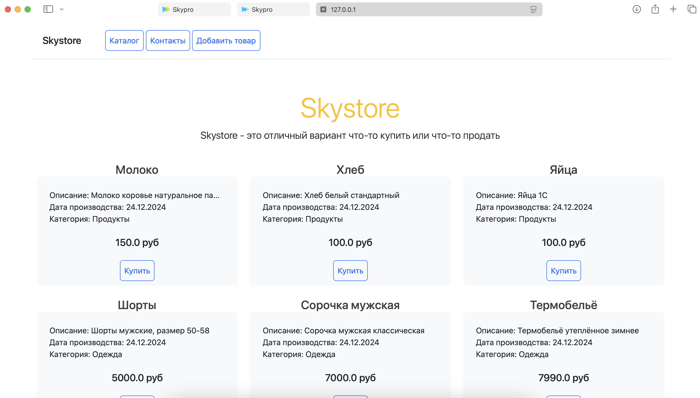
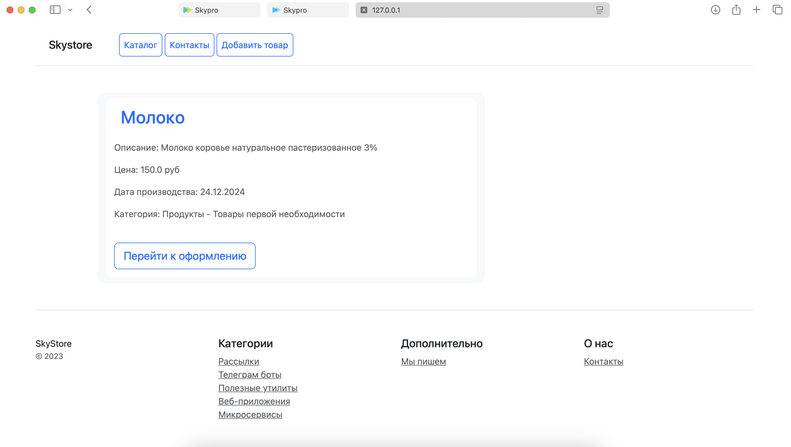
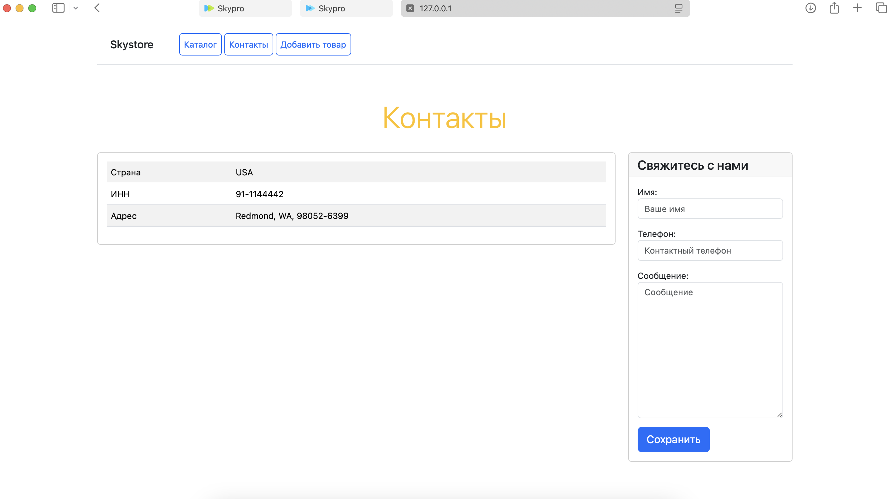
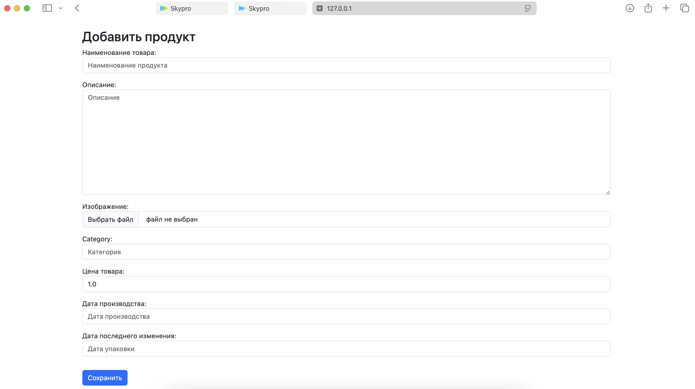

# 24 Шаблонизация

### Change Log

-- 2024-12-29 --
1. Главное меню (navbar) вытащил из "base.html" выделил в отдельный шаблон "navbar.html" и подключил его ко всем 
   шаблонам. Теперь "base.html" можно использовать и в модальных окнах без навигации.

2. В каталог товаров добавлены уменьшенные изображения товаров.

3. В шаблон детализации товара добавлены большие изображения товаров.

### Дальнейшая реализация прототипа интернет-магазина.

1. Создан новый контроллер и шаблон для отображения страницы с подробной информацией о товаре.

2. В шаблон главной страницы добавлен код для отображения списка товаров с помощью цикла. Чтобы карточки товаров 
   выглядели одинаково, отображаемое описание обрезано до первых 30 символов.

3. Проведена шаблонизация для устранения повторяющихся частей кода. А именно:
* Создан базовый шаблон, который содержит шапку, подвал и общие стили.

4. Реализована страница с формой, которая позволяет пользователю добавлять новые товары. По нажатию кнопки 
   "Сохранить" происходит обработка данных и сохранение нового товара в базу данных.

В постраничном выводе списка товаров я не вижу смысла, потому что на главной странице уже постранично выводятся 
   карточки всех 
   товаров.

# Описание приложения
### Главная страница содержит карточки товаров. Переход на главную страницу происходит при нажатии на кнопку "Каталог" главного меню.

### При нажатии на кнопку "Купить" на каточке товара происходит переход на страницу детальной информации о товаре.

### При нажатии на кнопку "Контакты" главного меню происходит переход на страницу контактов. При заполнении формы с контактными данными и нажатии кнопки "Сохранить" происходит запись контактных данных в базу данных.

### При нажатии на кнопку "Добавить товар" происходит переход на страницу добавления нового товара. При заполнении полей формы и нажатии кнопки "Сохранить" происходит запись данных о новом товаре в базу данных.

### При возвращении на страницу с карточками товаров новый товар отображается в конце списка.
